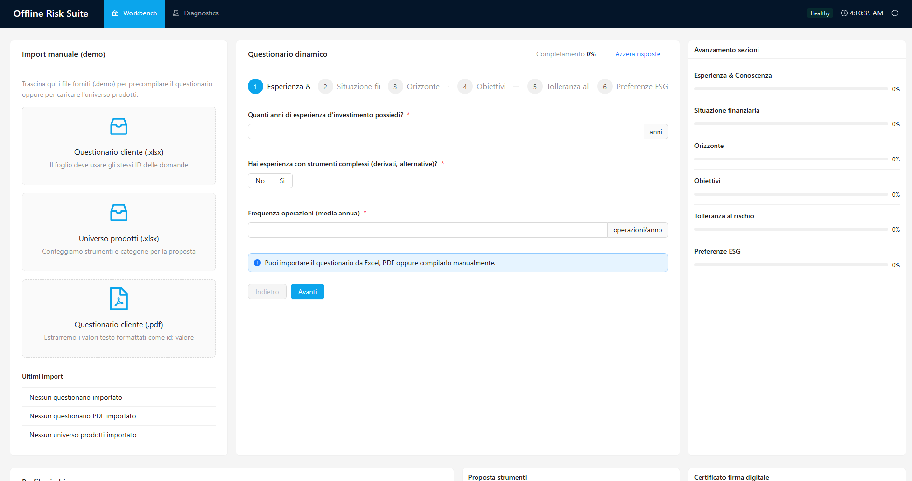

# DSK Finance CLC

[](#release-automation) [](#prerequisiti) [](#stack-tecnico) [](#stack-tecnico) [](#licenza)

> Workbench **offline** pensato per consulenti finanziari: importa questionari Excel/PDF, calcola il profilo di rischio, suggerisce il portafoglio coerente e genera report firmati digitalmente direttamente sul device del cliente.



---

## Indice
1. [Panoramica](#panoramica)
2. [Caratteristiche principali](#caratteristiche-principali)
3. [Stack tecnico](#stack-tecnico)
4. [Architettura](#architettura)
5. [Prerequisiti](#prerequisiti)
6. [Setup & comandi](#setup--comandi)
7. [Configurazione ambiente](#configurazione-ambiente)
8. [Testing & quality](#testing--quality)
9. [Packaging](#packaging)
10. [Release automation](#release-automation)
11. [Roadmap](#roadmap)
12. [Contributi](#contributi)
13. [Licenza](#licenza)

---

## Panoramica
**DSK Finance CLC (Client Lifecycle Companion)** è un'app Electron totalmente *self-contained*. Il progetto è strutturato per funzionare in filiale senza connettività: tutti i motori (questionario, scoring, firma) sono inclusi nell'eseguibile portable di Windows.

Obiettivi chiave:
- Digitalizzare il questionario MiFID importando file Excel/PDF forniti dal cliente.
- Calcolare il profilo di rischio tramite un motore deterministico e trasparente.
- Suggerire strumenti coerenti ed evidenziare gap di compliance.
- Firmare i report PDF con certificati P12/PFX caricati runtime.
- Fornire diagnostica locale (health, hash firma, metadati certificato) per tracciare eventuali anomalie.

---

## Caratteristiche principali
- **Motore questionario dinamico** – schema JSON validato con Zod + React Hook Form; progress sugli step e blocchi in caso di risposte incoerenti.
- **Import multipli** – Parser dedicati per workbook Excel (richieste e universo prodotti) e PDF strutturati, testati negli *engines*.
- **Motore scoring e suggerimenti** – Matching tra profilo e categorie di rischio con mapping modulare.
- **Firma digitale integrata** – `node-signpdf`, generazione hash SHA-256, gestione certificati e password in memoria.
- **UX coerente** – Ant Design 5, layout responsive full screen, card informative (Questionnaire, Score, Suggested Products, Certificate).
- **Hardening Electron** – `contextIsolation`, preload minimo tipizzato, logger centralizzato con filtro DevTools, blocco richieste non autorizzate.
- **Test coperti** – Oltre 100 test Jest per engines, servizi main, IPC, hooks e componenti renderer.

---

## Stack tecnico
| Layer        | Tecnologie |
|--------------|------------|
| Main process | Electron 38 · TypeScript strict · logger custom · IPC `health`/`report` |
| Preload      | ContextBridge isolato con API tipizzate (`window.api.health/report`) |
| Renderer     | React 19 · Ant Design 5 · Redux Toolkit · React Hook Form · React Router 6 |
| Engines      | Moduli standalone per questionnaire, scoring, importers, mapping, signature, report |
| Tooling      | electron-vite · Jest 29 · ESLint 9 · Prettier 3 · Husky + Commitlint |

---

## Architettura
```text
packages/
  main/       -> bootstrap Electron, logger, security, IPC, window manager
  preload/    -> bridge sicuro tra renderer e main (health/report)
  renderer/   -> shell React/Redux, pagine Profilation · Products · Settings
engines/      -> motori riutilizzabili (import, mapping, questionnaire, report, signature)
resources/    -> icone e assets per il packaging
assets/       -> screenshot e materiale marketing
env/          -> profili environment (.env.development / .env.production)
```

Diagramma dei flussi principali:
1. **Main** avvia l'app, applica l'hardening e carica eventualmente i DevTools.
2. **Preload** espone API limitate (`health`, `report`) al renderer.
3. **Renderer** guida l'operatore attraverso il questionario, import dei dati e dashboard.
4. **Engines** eseguono logica e validazioni offline (scoring, mapping, firma) condivise tra main e renderer.

---

## Prerequisiti
- Node.js >= 18
- npm >= 10
- Windows 10/11 (la build ufficiale è portable Windows)
- Facoltativo: certificato `.p12/.pfx` per testare la firma digitale

---

## Setup & comandi
```bash
npm install           # una tantum
npm run dev           # avvia electron-vite in modalità development
npm run start         # anteprima (renderer bundlato)
npm run build         # compila main/preload/renderer
npm run build:win     # build Windows portable (electron-builder)
npm run lint          # ESLint 9
npm run test          # Jest (node + jsdom)
```

| Script | Descrizione |
|--------|-------------|
| `npm run format` | Prettier 3 |
| `npm run typecheck` | TypeScript sia per main che per renderer |
| `npm run test:watch` | Esecuzione Jest in watch mode |

---

## Configurazione ambiente
I profili sono contenuti nella cartella `env/`:

- `env/.env.development`
  ```env
  LOG_LEVEL=debug
  ENABLE_DEVTOOLS=true
  APP_VERSION=0.1.0
  ```
- `env/.env.production`
  ```env
  LOG_LEVEL=info
  ENABLE_DEVTOOLS=false
  APP_VERSION=0.1.0
  ```

Variabili chiave:
| Variabile | Descrizione |
|-----------|-------------|
| `LOG_LEVEL` | Livello di log (debug/info/warn/error/silent) |
| `ENABLE_DEVTOOLS` | Abilita DevTools e l'estensione Redux in dev |
| `APP_VERSION` | Mostrata nel bootstrap e allineata con il package |

---

## Testing & quality
- **Jest 29** con doppio environment (node + jsdom)
- **Testing Library** per componenti React e hooks
- **ESLint 9** (preset Electron Toolkit + React/Hooks)
- **Prettier 3** per formato coerente
- **TypeScript Strict** su tutti i package
- **Husky + Commitlint** per assicurare commit in formato Conventional

---

## Packaging
- Target ufficiale: **Windows portable** (`dsk-finance-clc-<version>-portable.exe`)
- Configurato tramite `electron-builder.yml`
- Pipeline GitHub Actions (vedi sotto) genera l'eseguibile e allega i sorgenti alla release

---

## Release automation
- Workflow GitHub Actions: `.github/workflows/windows-portable.yml`
- Trigger: push su `develop`
- Step principali:
  1. Installazione dipendenze
  2. Build portable Windows
  3. Creazione release con tag `v<version>` e changelog differenziale
  4. Upload asset: portable `.exe` + archivio sorgenti

---

## Roadmap
| Wave | Focus |
|------|-------|
| 4 | Motore adeguatezza avanzato + explainability |
| 5 | Code signing ufficiale, auto-update in DMZ, accessibility AA |
| 6 | Multi-utenza locale, audit trail, cifratura storage temporaneo |

---

## Contributi
1. Fork & clone del repository
2. Crea un branch feature (`git checkout -b feat/nome-feature`)
3. Usa commit Conventional (`type(scope): breve descrizione`)
4. Apri una pull request verso `develop`

Per bug importanti allegare log (`LOG_LEVEL=debug`) e allegati Excel/PDF anonimizzati.

---

## Licenza
Rilasciato sotto licenza [MIT](LICENSE.md).

---

Made with ?? by **DSK Digital Lab**.
