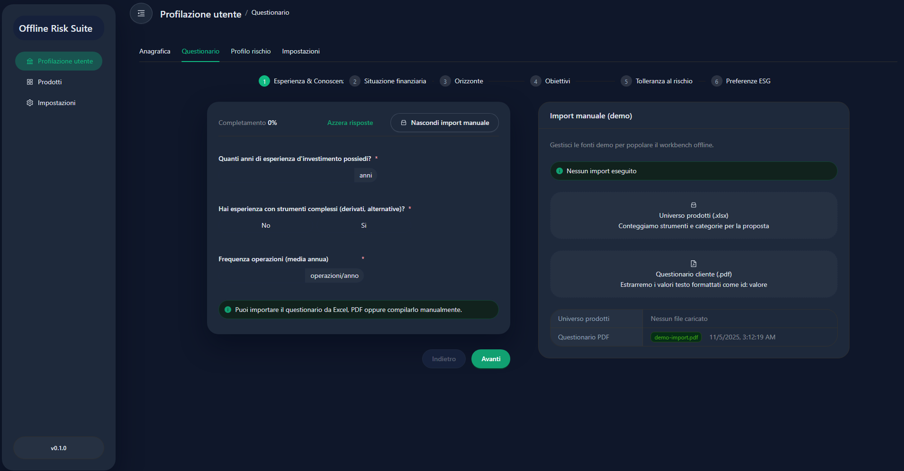

# DSK Electron React Finance CLC

[](#release-automation) [](#prerequisites) [](#tech-stack) [](#tech-stack) [](#license)

> Offline Electron workbench for financial advisors: import Excel/PDF questionnaires, compute the risk profile, surface compliant product suggestions and sign PDFs locally with your certificate.



---

## Table of contents
1. [Overview](#overview)
2. [Key features](#key-features)
3. [Tech stack](#tech-stack)
4. [Architecture](#architecture)
5. [Prerequisites](#prerequisites)
6. [Getting started](#getting-started)
7. [Environment configuration](#environment-configuration)
8. [Quality & testing](#quality--testing)
9. [Packaging](#packaging)
10. [Release automation](#release-automation)
11. [Roadmap](#roadmap)
12. [Contributing](#contributing)
13. [License](#license)

---

## Overview
**DSK Electron React Finance CLC (Client Lifecycle Companion)** is a self-contained Electron bundle designed to operate entirely offline inside the branch network. Every engine (questionnaire, scoring, mapping, digital signature) is shipped inside the portable executable so advisors can finish the onboarding process without connectivity.

### What it solves
- Import MiFID questionnaires supplied as Excel spreadsheets or structured PDFs.
- Calculate the customer risk profile with a deterministic, auditable engine.
- Highlight suitability gaps and recommend compliant products from the onboard product universe.
- Generate PDF reports and sign them locally using P12/PFX digital certificates.
- Provide on-device diagnostics (health status, certificate metadata, hash of the signed document).

---

## Key features
- **Dynamic questionnaire engine** – JSON schema validated with Zod + React Hook Form, per-step progress tracking and guard rails on inconsistent answers.
- **Multiple import paths** – Dedicated engines for workbook ingestion (requests + product universe) and structured PDFs, all with extensive unit tests.
- **Scoring & suggestion rules** – Modular mapping between target risk profiles and product categories, easy to tune per release.
- **Integrated digital signature** – `node-signpdf`, SHA-256 hashing and safe in-memory handling of certificate secrets.
- **Consistent UX** – Ant Design 5 components, responsive layout, informative cards (Questionnaire, Score, Suggested Products, Certificate insights).
- **Electron hardening** – `contextIsolation`, hardened preload bridge, centralised logger that filters noisy DevTools messages, outbound request guard.
- **Extensive tests** – >100 Jest specs across engines, main-process services, IPC boundaries, hooks and renderer components.

---

## Tech stack
| Layer        | Technologies |
|--------------|--------------|
| Main process | Electron 38 · TypeScript strict · custom logger · IPC channels (`health`, `report`) |
| Preload      | ContextBridge-exposed API (`window.api.health/report/environment`) |
| Renderer     | React 19 · Ant Design 5 · Redux Toolkit · React Hook Form · React Router 6 |
| Engines      | Standalone modules for questionnaire, mapping, scoring, report and signature pipelines |
| Tooling      | electron-vite · Jest 29 · ESLint 9 · Prettier 3 · Husky + Commitlint |

---

## Architecture
```text
packages/
  main/       -> Electron bootstrap, logger, security hooks, IPC routes, window manager
  preload/    -> secure bridge exposing typed APIs to the renderer
  renderer/   -> React shell (pages: Profilation · Products · Settings) + Redux store
engines/      -> Reusable business logic (imports, mapping, questionnaire normalisation, reporting, signature)
resources/    -> Packaging resources (icons, entitlements)
assets/       -> Marketing assets and screenshots
env/          -> Environment profiles (.env.development / .env.production)
```

Main flow:
1. **Main** initialises Electron, applies hardening and (optionally) loads Redux DevTools.
2. **Preload** exposes a minimal API surface to the renderer, plus environment information.
3. **Renderer** orchestrates the workflow: questionnaire, scoring, suggestions, PDF export.
4. **Engines** encapsulate pure business logic shared across renderer and main.

---

## Prerequisites
- Node.js ≥ 18
- npm ≥ 10
- Windows 10/11 for the official portable build (development works cross-platform)
- Optional: `.p12/.pfx` certificate for testing the digital signature flow

---

## Getting started
```bash
npm install           # install dependencies once
npm run dev           # start electron-vite in development mode
npm run start         # preview mode (bundled renderer)
npm run build         # compile main / preload / renderer assets
npm run build:win     # build Windows portable executable via electron-builder
npm run lint          # ESLint 9
npm run test          # Jest (node + jsdom)
```

Useful scripts:
| Script | Description |
|--------|-------------|
| `npm run format` | Run Prettier 3 across the repo |
| `npm run typecheck` | TypeScript checks for main and renderer targets |
| `npm run test:watch` | Run Jest in watch mode |
| `npm run version:set -- <x.y.z>` | Bump version in `package.json`, env files and README badge |

---

## Environment configuration
Environment profiles live inside the `env/` folder. They are picked automatically depending on `NODE_ENV`.

- `env/.env.development`
  ```env
  LOG_LEVEL=debug
  ENABLE_DEVTOOLS=true
  APP_VERSION=0.11.5
  ```
- `env/.env.production`
  ```env
  LOG_LEVEL=info
  ENABLE_DEVTOOLS=false
  APP_VERSION=0.11.5
  ```

| Variable | Purpose |
|----------|---------|
| `LOG_LEVEL` | Controls the verbosity of the main-process logger |
| `ENABLE_DEVTOOLS` | Enables Redux DevTools loading and the version badge in the sidebar |
| `APP_VERSION` | Displayed at bootstrap and in the development sidebar badge |

---

## Quality & testing
- **Jest 29** with dual environments (node & jsdom)
- **Testing Library** for React component and hook coverage
- **ESLint 9** (Electron Toolkit + React/Hooks presets)
- **Prettier 3** for formatting
- **TypeScript strict mode** across all packages
- **Husky + Commitlint** enforcing Conventional Commits locally and in CI

---

## Packaging
- Official target: **Windows portable** (`dsk-electron-react-finance-clc-<version>-portable.exe`)
- Powered by `electron-builder.yml` with portable output only (no macOS/Linux artifacts)
- CI workflow takes care of producing the executable and an accompanying source archive

---

## Release automation
- Workflow: `.github/workflows/windows-portable.yml`
- Trigger: push to `develop`
- Steps:
  1. Install dependencies
  2. Build portable Windows executable
  3. Create a tag `v<version>` (release body intentionally empty)
  4. Upload assets: portable `.exe` and zipped sources only

To bump the version consistently run:
```bash
npm run version:set -- 0.1.1
```

---

## Roadmap
| Wave | Focus |
|------|-------|
| 4 | Advanced suitability/appropriateness engine with explainability |
| 5 | Code signing, DMZ auto-update channel, accessibility AA |
| 6 | Local multi-user support, audit trail, encrypted temporary storage |

---

## Contributing
1. Fork and clone the repository.
2. Create a feature branch (`git checkout -b feat/<feature-name>`).
3. Follow Conventional Commit format (`type(scope): short description`).
4. Submit a pull request targeting `develop`.

When reporting issues, include debug logs (`LOG_LEVEL=debug`) and anonymised sample files when possible.

---

## License
Released under the [MIT](LICENSE.md) license.

---

Crafted with ❤️ by **5h1ngy**.
